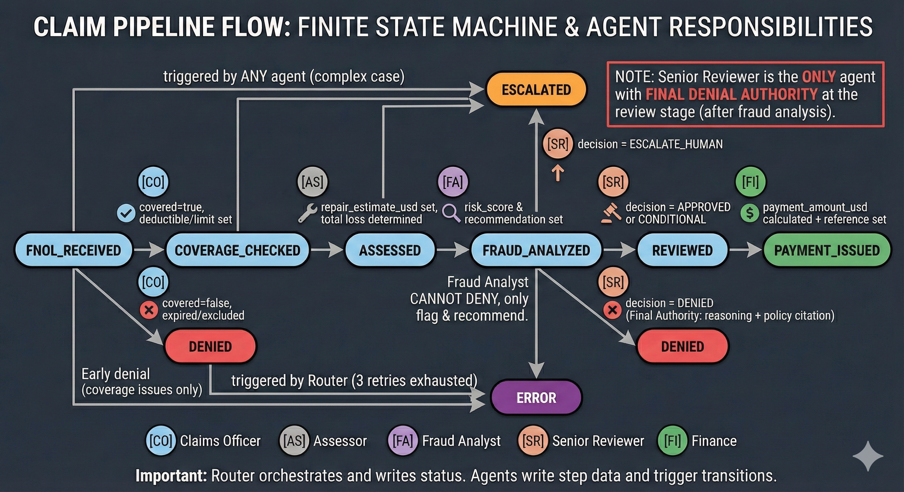
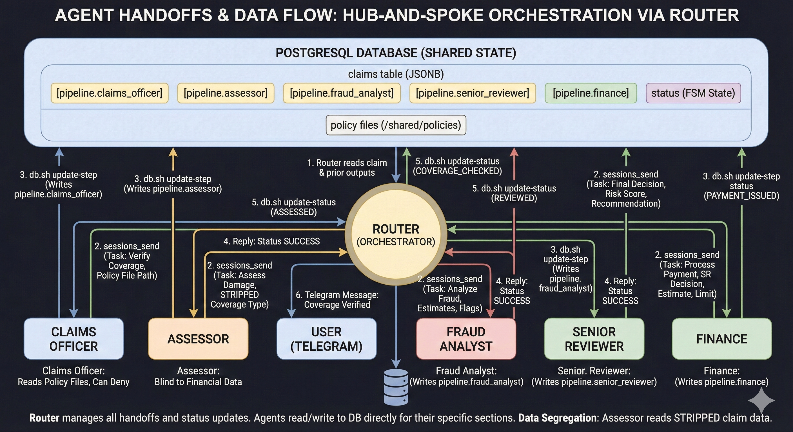

# Ohio Mutual Auto Claims Processing

Multi-agent AI pipeline for end-to-end insurance claims processing. Built on [OpenClaw](https://openclaw.com) for the [OpenClaw Business Engineering Hackathon](https://startit.rs/openclaw-hackathon/) (February 2026, Belgrade).

6 AI agents process a claim from first notice of loss to payment — with enforced data boundaries, fraud detection, and regulatory compliance.



## How It Works

A policyholder sends a Telegram message describing their car accident. The system:

1. Collects claim details via conversational FNOL (First Notice of Loss)
2. Runs AI damage detection on uploaded photos (VehicleInsights API)
3. Processes the claim through 5 specialist agents sequentially
4. Sends a PDF claim report via Telegram when complete

**Average pipeline time:** ~4 minutes from FNOL to payment decision.

## The Pipeline

```
FNOL_RECEIVED → COVERAGE_CHECKED → ASSESSED → FRAUD_ANALYZED → REVIEWED → PAYMENT_ISSUED
     │                │                                            │
     │                └→ DENIED                                    └→ DENIED
     │
     └→ ESCALATED (any stage)
     └→ ERROR (retries exhausted)
```

| # | Agent | Role | Key Decision |
|---|-------|------|-------------|
| 0 | **Router** | Orchestrator + Telegram interface | FNOL intake, agent dispatch, status transitions, user comms |
| 1 | **Claims Officer** | Coverage verification | Is the policy active? Does it cover this incident? Can deny on coverage. |
| 2 | **Assessor** | Damage estimation | How much to repair? Total loss? Blind to financial data. |
| 3 | **Fraud Analyst** | Pattern detection | 7 fraud patterns analyzed. Flags only — cannot deny. |
| 4 | **Senior Reviewer** | Decision authority | Approve, deny (with policy citation), or escalate. Final call. |
| 5 | **Finance** | Payment processing | Calculate payment, apply deductible/depreciation, identify subrogation. |

## Architecture: Hub-and-Spoke Orchestration



Agents **never talk to each other**. The Router orchestrates every handoff:

1. Router reads claim from PostgreSQL
2. Router builds a scoped task message (only the context the next agent needs)
3. Router calls agent via `sessions_send` (synchronous RPC)
4. Agent reads claim from DB, does its work, writes results via `db.sh update-step`
5. Agent replies SUCCESS / ERROR / NEED_INFO / ESCALATE
6. Router validates, updates claim status, notifies user on Telegram
7. Repeat for next agent

**Database as shared state** — agents don't pass data directly. Each writes to its `pipeline.<agent>` section in PostgreSQL JSONB. Clean handoff, survives crashes.

### What gets passed between agents

| From → To | What Router includes in task message |
|-----------|-------------------------------------|
| Router → Claims Officer | Policy file path, claim ID |
| Router → Assessor | Coverage type ONLY (no deductible, no limit) |
| Router → Fraud Analyst | Repair estimate, total loss flag, pre-existing flags, user ID |
| Router → Senior Reviewer | Risk score, risk level, fraud recommendation |
| Router → Finance | SR decision, conditions, estimate, deductible, limit |

Each agent gets **only the context it needs** from prior stages.

## Data Segregation

The most important architectural decision. Each agent sees **only** what it needs.

### Assessor — Blind to Financial Data

The Assessor uses `get-claim-assessor` instead of `get-claim`. This command strips financial fields at the SQL level using PostgreSQL's `#-` operator:

```sql
SELECT claim_data #- '{pipeline,claims_officer,deductible_amount}'
                  #- '{pipeline,claims_officer,coverage_limit}'
FROM claims WHERE claim_id = $1;
```

**Why:** Anchoring bias. If an assessor sees a $50,000 coverage limit, they unconsciously estimate higher. Blind assessment = honest estimate. This mirrors real insurance industry best practice.

### Fraud Analyst — Full Data, No Decision Power

The Fraud Analyst can see everything (needed to detect estimate-to-limit padding fraud) but **cannot deny claims**. It only recommends: CLEAR / INVESTIGATE / REFER_SIU. The Senior Reviewer makes the final call.

**Why:** Separating pattern-detection from denial authority prevents false positives from becoming wrongful denials.

### The Separation of Concerns Chain

```
Claims Officer    →  "Is this covered?"        →  CAN deny (coverage only)
Assessor          →  "How much damage?"         →  CANNOT see financial limits
Fraud Analyst     →  "Is this suspicious?"      →  CANNOT deny (flags only)
Senior Reviewer   →  "Should we pay?"           →  CAN deny (final authority)
Finance           →  "How much to pay?"         →  CANNOT override SR decision
```

### Agent Permissions Matrix

| | Router | Claims Officer | Assessor | Fraud Analyst | Senior Reviewer | Finance |
|---|:---:|:---:|:---:|:---:|:---:|:---:|
| Talks to user | YES | - | - | - | - | - |
| Calls other agents | YES | - | - | - | - | - |
| Sets claim status | YES | - | - | - | - | - |
| Reads full claim | YES | YES | **NO** (stripped) | YES | YES | YES |
| Reads policy files | - | YES | - | - | - | - |
| Reads user history | - | - | - | YES | YES | - |
| Can deny claim | - | YES (coverage) | - | **NO** (flags only) | YES (final) | - |
| Writes payment | - | - | - | - | - | YES |

## The Secret Addition

On hackathon day, we received conflicting stakeholder demands (see [docs/secret-addition-brief.pdf](docs/secret-addition-brief.pdf)):

- **COO:** "Give the assessor policy info to decide faster" (wants speed)
- **Compliance Officer:** "Separation between assessment and financial data is required by regulators" (wants walls)
- **Customer Experience:** "Front desk needs to give status updates without transferring" (wants transparency)
- **Fraud Prevention:** "We need to see both estimates and financials to catch fraud" (wants access)

**Our resolution:**
- Assessor stays blind to financials (compliance wins — $4.1M in fines > $4M in efficiency savings)
- Fraud Analyst gets full data visibility but zero denial authority (fraud detection works, separation of concerns prevents abuse)
- Router handles all user communication — no transfers, real-time Telegram updates at every stage
- Senior Reviewer resolves tensions — holistic review with full context, documented reasoning

## AI Integrations

### Vehicle Damage Detection (VehicleInsights API)
During FNOL, uploaded photos are analyzed via computer vision:
- Vehicle identification (make, model, color)
- Per-part damage detection with severity and estimated repair cost
- Overall assessment (driveable, total loss, safety impact)

Results feed into the Assessor (baseline estimates) and Fraud Analyst (pre-existing damage indicators like rust).

### PDF Claim Reports
At pipeline completion, a PDF report is generated via pandoc and sent via Telegram Bot API:
- Claimant and incident details
- AI vehicle/damage detection results
- Coverage verification, damage assessment, fraud analysis
- Final decision and payment details

## Project Structure

```
openclaw.json                    # OpenClaw agent configuration (6 agents, tools, routing)
setup.sh                         # VPS provisioning (PostgreSQL, OpenClaw, dependencies)
workspaces/
  router/AGENTS.md               # Router orchestrator specification
  claims-officer/AGENTS.md       # Coverage verification specialist
  assessor/AGENTS.md             # Damage estimation specialist (data-segregated)
  fraud-analyst/AGENTS.md        # Fraud pattern detection (7 patterns, flags only)
  senior-reviewer/AGENTS.md      # Decision authority (approve/deny/escalate)
  finance/AGENTS.md              # Payment calculation
shared/
  scripts/
    db.sh                        # Central DB CLI (create/read/update claims, traces)
    damage-detect.sh             # VehicleInsights API wrapper
    generate-report.sh           # PDF claim report generator (pandoc + wkhtmltopdf)
    send-telegram-doc.sh         # Telegram file sender via Bot API
  policies/                      # Mock policy JSON files
  test-scripts/                  # Pin-test framework for agent isolation testing
docs/
  FLOW.md                        # Pipeline flow technical cheat sheet
  TECHNICAL.md                   # Implementation details, DB schema, known limitations
  hackathon-brief.pdf            # Original hackathon challenge
  secret-addition-brief.pdf      # Day-of stakeholder conflicts
```

## Setup

### Environment Variables

```bash
export TELEGRAM_BOT_TOKEN=       # Telegram Bot API token (from @BotFather)
export RAPIDAPI_KEY=             # VehicleInsights damage detection API key
export OPENROUTER_API_KEY=       # OpenRouter API key (for LLM access)
export DB_PASS=                  # PostgreSQL password
```

### Quick Deploy

```bash
chmod +x setup.sh
./setup.sh --telegram-token "$TELEGRAM_BOT_TOKEN" --telegram-user "YOUR_TELEGRAM_USER_ID"
```

Then message your Telegram bot: _"I was rear-ended at a red light on Main St. My policy is POL-AUT-10001."_

## Tech Stack

- **Agent layer:** [OpenClaw](https://openclaw.com) — multi-agent platform with isolated workspaces
- **Models:** Claude Sonnet 4.6 (Router), Grok 4.1 Fast (specialist agents) via OpenRouter
- **Database:** PostgreSQL with JSONB
- **Channel:** Telegram Bot API
- **AI Vision:** VehicleInsights RapidAPI
- **PDF:** pandoc + wkhtmltopdf
- **Infra:** Hetzner VPS (Ubuntu)

## Observability

Every agent logs structured traces to the `agent_traces` table:
- **START** — agent begins processing
- **STEP** — key decisions/milestones
- **END** — agent completes successfully
- **ERROR** — failures with details

Plus a business-level `audit_log` array inside each claim document capturing what decisions were made and why.

---

Built for the [OpenClaw Business Engineering Hackathon](https://startit.rs/openclaw-hackathon/), February 21, 2026 in Belgrade.
